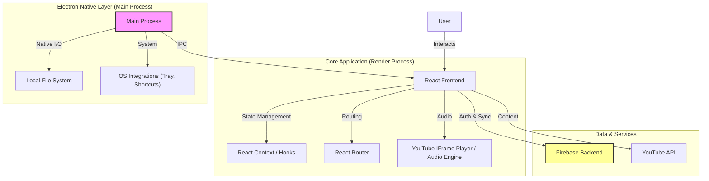
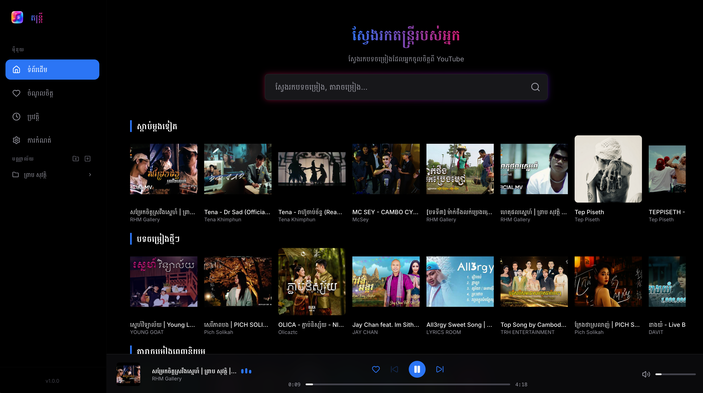

# Music App

A feature-rich, hybrid music player application that brings the best of YouTube Music to your desktop and web browser. Built with modern web technologies, it offers a seamless listening experience with robust local integration when running as a desktop app.

## 🏗 Architecture

The application is designed as a hybrid system that can run in two modes: **Web** and **Electron (Desktop)**. This ensures cross-platform accessibility while unlocking native capabilities when installed on a device.

### High-Level Architecture



### Key Components

*   **Frontend (Renderer)**: Built with **React 19**, **TypeScript**, and **Vite**. It handles the UI, state, and audio playback logic.
*   **Desktop Layer (Main)**: Powered by **Electron**, enabling native features like file system access for downloads, global shortcuts, and a closer-to-native performance.
*   **Styling**: Uses **TailwindCSS** for a responsive and modern design, with **Framer Motion** for smooth animations.
*   **Backend**: Integrates with **Firebase** for user authentication and data synchronization.

## ✨ Key Features

*   **Hybrid Playback**: Stream directly from YouTube with a custom, ad-free UI.
*   **Offline Support**: (Electron) Download tracks locally using native file system integration.
*   **Smart Playlists**: Organize your music with ease.
*   **Modern UI**: Sleek, dark-themed interface with smooth transitions.

## 🚀 Development

### Prerequisites
*   Node.js (Latest LTS recommended)
*   npm

### Setup

```bash
# Install dependencies
npm install
```

### Running the App

**Web Mode:**
```bash
npm run dev
```
Runs the application in your default browser at `http://localhost:5173`.

**Electron Mode:**
```bash
npm run electron:dev
```
Launches the application in a standalone Electron window with full native capabilities.

### Building for Production

```bash
npm run electron:build
```
Generates installers for your OS (macOS .dmg/.zip, Windows .exe, Linux .AppImage) in the `release/` directory.

## 🛠 Configuration details

This project uses a standard Vite + React setup.

### ESLint Configuration
If you are developing a production application, we recommend updating the configuration to enable type-aware lint rules:

```js
export default defineConfig([
  globalIgnores(['dist']),
  {
    files: ['**/*.{ts,tsx}'],
    extends: [
      tseslint.configs.recommendedTypeChecked,
      tseslint.configs.stylisticTypeChecked,
    ],
    languageOptions: {
      parserOptions: {
        project: ['./tsconfig.node.json', './tsconfig.app.json'],
        tsconfigRootDir: import.meta.dirname,
      },
    },
  },
])
```
## Screenshots

### Desktop


### Mobile

